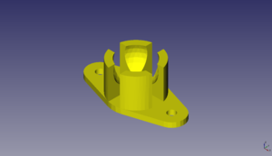
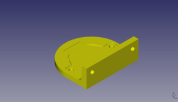
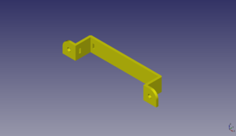
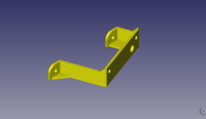
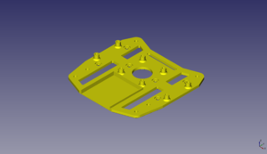
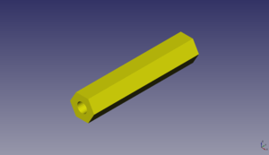
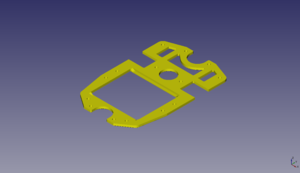
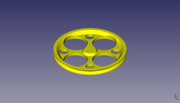

# Escornabot Placidus

## 3D spare parts (STL)

image         | file
------------- | -------------
 | [BallCaster_14.5mm.stl](STL/BallCaster_14.5mm.stl)
 | [Bracket_28BYJ-48.stl](STL/Bracket_28BYJ-48.stl)
 | [Bracket_4xAABatteryHolder.stl](STL/Bracket_4xAABatteryHolder.stl)
 | [Bracket_Keypad-Left.stl](STL/Bracket_Keypad-Left.stl)
 | [Bracket_Keypad-Right.stl](STL/Bracket_Keypad-Right.stl)
 | [MainPlate.stl](STL/MainPlate.stl)
 | [PlateSpacer_28mm.stl](STL/PlateSpacer_28mm.stl)
 | [PlateSpacer_30mm.stl](STL/PlateSpacer_30mm.stl)
 | [UnderPlate.stl](STL/UnderPlate.stl)
 | [Wheel_72mm.stl](STL/Wheel_72mm.stl)

## Source files

  * [FreeCAD](FreeCAD)
  * [OpenSCAD](OpenSCAD)
  * [STEP](STEP)

